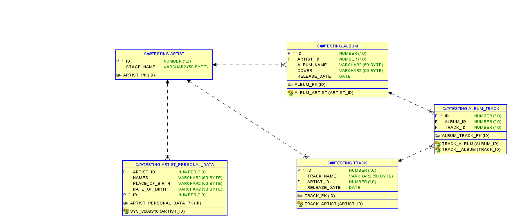

# Artiste Project Management
The database is designed to store and manage information related to music artists, their albums, tracks, and personal details. It includes tables for storing artist information, album details, track information, and artist personal data. The database allows for tracking relationships between artists and their albums and tracks, as well as storing information about album and track release dates.



# SQL Commands Executed

This document provides a description of the SQL commands executed to create and manipulate a database for managing artists, albums, and tracks.

## 1. Create Tables

### Create Artist Table
```sql
CREATE TABLE artist(
    id int PRIMARY KEY, 
    stage_name VARCHAR(50)
);
```
*Purpose*: Creates a table named artist with an id as the primary key and a stage_namef ield.

```sql
CREATE TABLE artist_personal_data(
    id int PRIMARY KEY, 
    artist_id int, 
    names varchar(50), 
    place_of_birth varchar(50), 
    date_of_birth varchar(50), 
    FOREIGN KEY(artist_id) REFERENCES artist(id)
);
```
*Purpose:* Creates a table artist_personal_data that references the artist table. It stores additional information about each artist.

```sql
CREATE TABLE album(
    id int GENERATED BY DEFAULT AS IDENTITY PRIMARY KEY, 
    artist_id int, 
    album_name VARCHAR(50), 
    cover VARCHAR(50), 
    release_date DATE, 
    CONSTRAINT album_artist FOREIGN KEY(artist_id) REFERENCES artist(id)
);
```
*Purpose:* Creates a table album with a foreign key referencing the artist table, to link albums to their respective artists.
```sql
CREATE TABLE track(
    id int GENERATED BY DEFAULT AS IDENTITY PRIMARY KEY, 
    track_name VARCHAR(50), 
    artist_id int, 
    release_date date, 
    CONSTRAINT track_artist FOREIGN KEY(artist_id) REFERENCES artist(id)
);
```

*Purpose:* Creates a table track that contains information about individual tracks linked to artists.
```sql
CREATE TABLE album_track(
    id int GENERATED BY DEFAULT AS IDENTITY PRIMARY KEY, 
    album_id int, 
    track_id int, 
    CONSTRAINT track_album FOREIGN KEY(album_id) REFERENCES album(id), 
    CONSTRAINT track_artist FOREIGN KEY(track_id) REFERENCES track(id)
);
```
*Purpose:* Creates a table album_track to associate tracks with albums.

```sql
COMMIT;
```
*Purpose:* Saves all changes made in the current transaction.


### Insert Data into Artist
```sql
INSERT INTO artist VALUES(1, 'jay Z');
INSERT ALL 
    INTO artist VALUES (2, 'Rick Ross')
    INTO artist VALUES (3, 'Roddy Rich')
    INTO artist VALUES (4, 'Method Man')
SELECT * FROM dual;
```
## 2. Adding Data to Tables
### Insert Data into Artist Personal Data
```sql
INSERT INTO artist_personal_data VALUES(2, 'William Leonard Roberts II', 'Clarksdale, Mississippi, U.S', 'January 28, 1976', 1);
INSERT INTO artist_personal_data VALUES(1, 'Shawn Corey Carter', 'Brooklyn, New York City, U.S', 'December 4, 1969', 2);
INSERT INTO artist_personal_data VALUES(3, 'Rodrick Wayne Moore Jr.', 'Compton, California, U.S.', 'October 22, 1998', 3);
INSERT INTO artist_personal_data VALUES(4, 'Clifford Smith, Jr.', 'Long Island, New York, U.S.', 'March 2, 1971', 4);
```
### Insert Data into Track
```sql
INSERT INTO track VALUES(1, 'Tical', 4, TO_DATE('15-11-1994', 'DD-MM-YYYY'));
INSERT INTO track VALUES(2, 'Meth vs. Chef', 4, TO_DATE('15-11-1994', 'DD-MM-YYYY'));
INSERT INTO track VALUES(3, 'December 4th', 1, TO_DATE('14-11-2003', 'DD-MM-YYYY'));
INSERT INTO track VALUES(4, 'Takeover', 1, TO_DATE('11-9-2001', 'DD-MM-YYYY'));
INSERT INTO track VALUES(5, 'The Box', 3, TO_DATE('11-1-2019', 'DD-MM-YYYY'));
```
### Insert Data into Album
```sql
INSERT INTO album VALUES(1, 1, 'The Blueprint', 'cover.jpg', TO_DATE('11-9-2001', 'DD-MM-YYYY'));
INSERT INTO album VALUES(2, 2, 'Port of Miami', 'cover.jpg', TO_DATE('8-8-2006', 'DD-MM-YYYY'));
INSERT INTO album VALUES(3, 3, 'Please Excuse Me for Being Antisocial', 'cover.jpg', TO_DATE('12-6-2019', 'DD-MM-YYYY'));
INSERT INTO album VALUES(4, 4, 'Tical', 'cover.jpg', TO_DATE('15-11-1994', 'DD-MM-YYYY'));
```

### Insert Data into Album Track
```sql
INSERT INTO album_track VALUES(1, 1, 3);
INSERT INTO album_track VALUES(2, 4, 1);
INSERT INTO album_track VALUES(3, 4, 2);
INSERT INTO album_track VALUES(4, 3, 5);
```
### Savepoint
```sql
SAVEPOINT datainserted;
```
## 3. Inserting Data to be Updated and Deleted
### Insert Data
```sql
INSERT INTO artist VALUES (5, 'Akon');
INSERT INTO artist_personal_data VALUES(5, 'Aliaune Damala Lu Lu Lu Badara Akon Thiam', 'Senegalese', 'April 16, 1973', 5);
```
### Update Data
```sql
UPDATE artist_personal_data SET place_of_birth = 'St. Louis, Missouri, U.S.' WHERE id = 5;
```
### Delete Data
```sql
DELETE FROM artist_personal_data WHERE id = 5;
ROLLBACK;
```
## 4. Performing Select Queries
### Select All Data
```sql
SELECT * FROM artist;
SELECT * FROM artist_personal_data;
SELECT * FROM track;
SELECT * FROM album;
SELECT * FROM album_track;
```

### Select Specific Columns
```sql
SELECT names, place_of_birth FROM artist_personal_data;
SELECT COUNT(id) FROM album_track WHERE album_id = 4;
```
### Subquery
```sql
SELECT artist_personal_data.names, artist_personal_data.place_of_birth, artist.stage_name
FROM artist_personal_data, artist
WHERE artist_personal_data.artist_id = artist.id;
```
## 5. Joins

### Full Join
```sql
SELECT * FROM artist JOIN artist_personal_data ON artist.id = artist_personal_data.artist_id;
```
### Left Join
```sql
SELECT * FROM artist LEFT JOIN album ON artist.id = album.artist_id;
```
### Right Join
```sql
SELECT * FROM artist RIGHT JOIN track ON artist.id = track.artist_id;
```
### Inner Join
```sql
SELECT * FROM artist INNER JOIN album ON artist.id = album.artist_id JOIN artist_personal_data ON artist.id = artist_personal_data.artist_id;
```
## 6. Data Control Language (DCL)
### Create User
```sql
CREATE user C##plsql IDENTIFIED BY plsql;
```
### Grant Privileges
```sql
GRANT CREATE SESSION TO C##plsql;
GRANT CREATE TABLE TO C##plsql;
```
### Revoke Privileges
```sql
REVOKE CREATE TABLE FROM C##plsql;
```
### Delete User
```sql
DROP USER C##plsql CASCADE;
```
